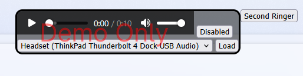
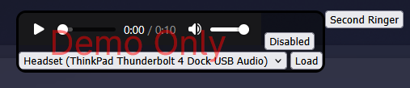

# Second Ringer POC Demo

> This is a demo widget to show how a second ringer can be played on a second audio device, like the computer speaker when an agent receives a new inbound call or consult request.  This is intended to be used when webRTC is selected as the telephony type so that the ringer can be heard if the agent is not currently wearing their headset.

## Steps to test
1. Download second-ringer_Layout.json and assign as a desktop layout
2. Log in with the team which has the desktop layout assigned.
3. Click the **Second Ringer** button in the header.
4. Select the audio device you want to have the second ringer to played when a new inbound contact is offered.
      1. You can test the audio and adjust the volume using the audion controls.
5. Click the button labeled **Disabled** to toggle the widget to Enabled.
6. Click the **Second Ringer** button to dismiss the dialog box.
7. Make an inbound test call. 

### UI
Light Mode
> 

Dark Mode
> 